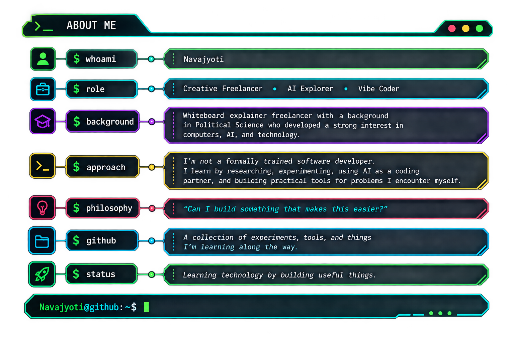
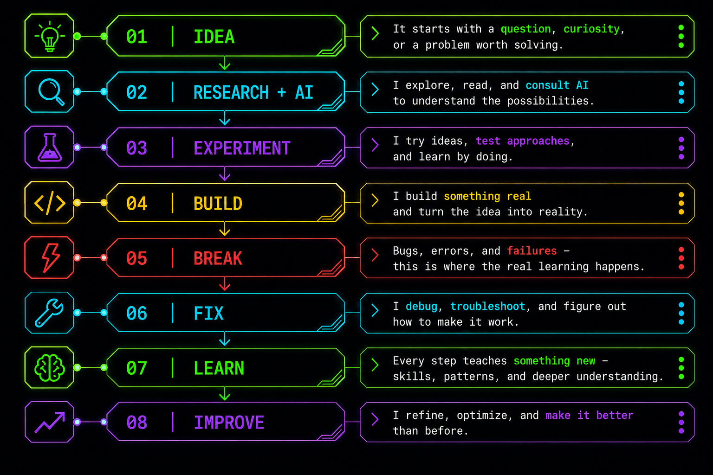

# 👋 Hi, I'm Navajyoti

### Creative Freelancer · AI Explorer · Vibe Coder

**Learning technology by building useful things.**

---

  <picture>
    
  </picture>

---

## 🚀 Featured Projects

<!-- AUTO-REPO-LIST:START -->

<table width="100%" border="1" cellpadding="10" cellspacing="0">
<tr><td colspan="2">● ● ● &nbsp; <code>Navajyoti@github:~$ pinned --list</code></td></tr>
<tr>
<td width="50%" valign="top">

**<a href="https://github.com/NavajyotiBayan/IDM-Tool">[01] IDM-Tool</a>**

No description provided.

`PowerShell`

⭐ 0 &nbsp;·&nbsp; 🍴 0

</td>
<td width="50%" valign="top">

**<a href="https://github.com/NavajyotiBayan/MIMI-Baby-Studio">[02] MIMI-Baby-Studio</a>**

Private, local Windows productivity studio for converting videos and images into PDF documents

`JavaScript`

⭐ 0 &nbsp;·&nbsp; 🍴 0

</td></tr>
<tr>
<td width="50%" valign="top">

**<a href="https://github.com/NavajyotiBayan/PhotoChronicle">[03] PhotoChronicle</a>**

Google Takeout photo organizer for restoring timestamps and organizing your media.

`Python`

⭐ 0 &nbsp;·&nbsp; 🍴 0

</td><td width="50%"></td></tr>
<tr><td colspan="2"><code>Navajyoti@github:~$ _</code></td></tr>
</table>
<!-- AUTO-REPO-LIST:END -->

---

  <picture>
    
  </picture>

---

## 🧠 How I Learn

  <picture>
    
  </picture>

