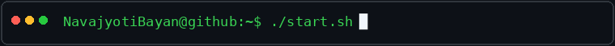

<div align="center">



<br>

### **Navajyoti Bayan**
`Creative Freelancer` · `AI Explorer` · `Vibe Coder`

**Building useful tools with AI-assisted development, research & experimentation.**

[GitHub](https://github.com/NavajyotiBayan) · [LinkedIn](https://www.linkedin.com/in/navajyoti/)

</div>

---

```text
$ whoami
Navajyoti Bayan
```

> Whiteboard explainer freelancer with a background in **Political Science** and a strong interest in **computers, AI, automation, and practical software tools**.
>
> I learn by researching, experimenting, using AI as a coding partner, and turning everyday problems into useful projects.

```text
$ echo "Build something useful. Learn how it works. Improve it."
```

<table>
<tr>
<td width="46%" valign="top">

```text
$ cat about_me.txt
```

### `ABOUT ME`

**Focus**

`AI-assisted development`  
`Windows automation`  
`Desktop tools`  
`UI/UX`

**Mindset**

```text
IDEA
 ↓
RESEARCH + AI
 ↓
EXPERIMENT
 ↓
BUILD
 ↓
BREAK → FIX
 ↓
LEARN → IMPROVE
```

</td>

<td width="54%" valign="top">

```text
$ ls ~/featured-projects
```

### `FEATURED PROJECTS`

<!-- AUTO-REPO-LIST:START -->

<table>
<tr>
<td>

**`$ 1.` [IDM-Tool](https://github.com/NavajyotiBayan/IDM-Tool)**

Personal project and experiment.

`PowerShell` · ⭐ 0 · ⑂ 0

</td>
</tr>
<tr>
<td>

**`$ 2.` [G-Takeout-Tools](https://github.com/NavajyotiBayan/G-Takeout-Tools)**

Modern Windows 11 utility for fixing Google Takeout media timestamps.

`PowerShell` · ⭐ 0 · ⑂ 0

</td>
</tr>
</table>

<!-- AUTO-REPO-LIST:END -->

<sub>Projects above are synced automatically from GitHub pinned repositories.</sub>

</td>
</tr>
</table>

---

```text
$ cat tech_stack.txt
```

### `TECH STACK`

<p>


</p>

---

```text
$ ./currently-learning.sh
```

### `CURRENTLY EXPLORING`

```text
AI & LLM Tools        ████████████████████
Vibe Coding           ██████████████████
PowerShell            █████████████████
Windows Automation    ████████████████
WPF / XAML            ███████████████
UI/UX Design          ██████████████
```

*The bars represent areas of current interest, not formal proficiency ratings.*

---

```text
$ cat connect.txt
```

### `CONNECT WITH ME`

```text
GitHub      → github.com/NavajyotiBayan
LinkedIn    → linkedin.com/in/navajyoti/
```

[](https://github.com/NavajyotiBayan)
[](https://www.linkedin.com/in/navajyoti/)

---

<div align="center">

```text
$ echo "Code. Learn. Build. Automate. Repeat."
```

**Code. Learn. Build. Automate. Repeat. 🚀**

<sub>Thanks for visiting my profile.</sub>

</div>
